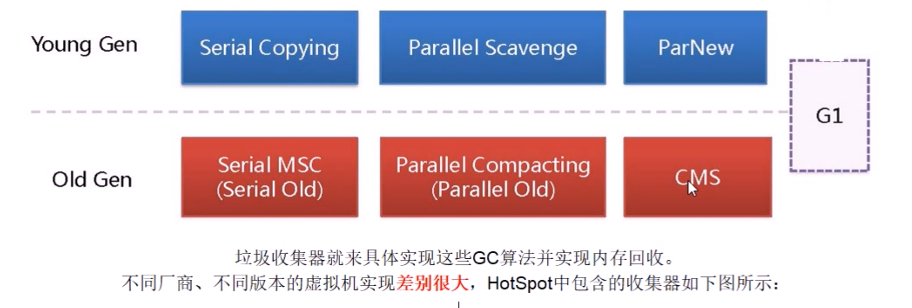
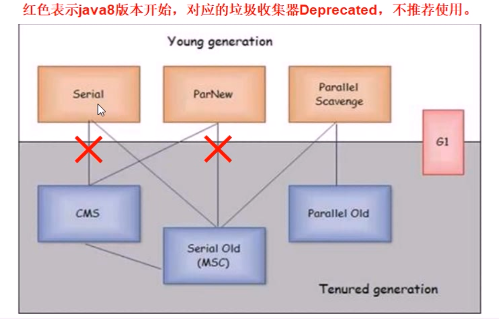

[TOC]

# java 高级

## 数据结构与JUC

### 常见数据结构

#### 数据结构整体

```js
Collection
├List
│├LinkedList
│├ArrayList
│└Vector
│　└Stack
└Set
│    └HashSet
│    		└LinkedHashSet
|    └TreeSet
└Queue

Map
├Hashtable
├HashMap
│	└LinkedHashMap
├TreeMap
└WeakHashMap
```


#### 图示:


#### 数据结构细节分析

* #### ArrayList

    * 底层原理:
        * 底层就是一个数组, 因此按序查找快, 乱序插入, 删除因为涉及到后面元素移位所以性能慢.
        * 扩容: 一般默认容量是10, 扩容后, 会length*1.5.
        * ArrayList中的对象数组的最大数组容量为Integer.MAX_VALUE – 8。
        
    * 特点与知识点:

        * 线程不安全:
            * 对ArrayList进行添加元素的操作的时候是分两个步骤进行的，即第一步先在object[size]的位置上存放需要添加的元素；第二步将size的值增加1。由于这个过程在多线程的环境下是不能保证具有原子性的，因此ArrayList在多线程的环境下是线程不安全的。
        * 想要实现线程安全:
            * 第一，使用synchronized关键字；
            * 第二，可以用Collections类中的静态方法synchronizedList()
            * CopyOnWriteArrayList
    * 优缺点:

        * ArrayList的优点
          
            * ArrayList底层以数组实现，是一种随机访问模式，再加上它实现了RandomAccess接口，因此查找也就是get的时候非常快。
            * ArrayList在顺序添加一个元素的时候非常方便，只是往数组里面添加了一个元素而已。
            * 根据下标遍历元素，效率高。
            * 根据下标访问元素，效率高。
            * 可以自动扩容，默认为每次扩容为原来的1.5倍。
                    
            
        * ArrayList的缺点
        
            * 插入和删除元素的效率不高。
            * 根据元素下标查找元素需要遍历整个元素数组，效率不高。
            * 线程不安全。
        
              

* #### LinkedList

    * 底层原理:

        * LinkedList 是一个继承于AbstractSequentialList的双向链表。它也可以被当作堆栈、队列或双端队列进行操作。 
        * LinkedList 实现 List 接口，能对它进行队列操作。
        * LinkedList 实现 Deque 接口，即能将LinkedList当作双端队列使用。
        * LinkedList 实现了Cloneable接口，即覆盖了函数clone()，能克隆。
        * LinkedList 实现java.io.Serializable接口，这意味着LinkedList支持序列化，能通过序列化去传输。
        * LinkedList 是非同步的。

    * 特点与知识点

        * AbstractSquentialList 接口

            * AbstractSequentialList 实现了get(int index)、set(int index, E element)、add(int index, E element) 和 remove(int index)这些函数。**这些接口都是随机访问List的**，LinkedList是双向链表；既然它继承于AbstractSequentialList，就相当于已经实现了“get(int index)这些接口”。

                此外，我们若需要通过AbstractSequentialList自己实现一个列表，只需要扩展此类，并提供 listIterator() 和 size() 方法的实现即可。若要实现不可修改的列表，则需要实现列表迭代器的 hasNext、next、hasPrevious、previous 和 index 方法即可。

        * LinkedList包含两个重要的成员：header 和 size。

            * header是双向链表的表头，它是双向链表节点所对应的类Entry的实例。Entry中包含成员变量： previous, next, element。其中，previous是该节点的上一个节点，next是该节点的下一个节点，element是该节点所包含的值。 
            * size是双向链表中节点的个数。
            
            

* #### Vector

    * 底层原理:

        * Vector的数据结构和[ArrayList](http://www.cnblogs.com/skywang12345/p/3308556.html)差不多，它包含了3个成员变量：elementData , elementCount， capacityIncrement。
        * 具体特点
            * (01) elementData 是"Object[]类型的数组"，它保存了添加到Vector中的元素。elementData是个动态数组，如果初始化Vector时，没指定动态数组的>大小，则使用默认大小10。随着Vector中元素的增加，Vector的容量也会动态增长，capacityIncrement是与容量增长相关的增长系数，具体的增长方式，请参考源码分析中的ensureCapacity()函数。
            * (02) elementCount 是动态数组的实际大小。
            * (03) capacityIncrement 是动态数组的增长系数。如果在创建Vector时，指定了capacityIncrement的大小；则，每次当Vector中动态数组容量增加时>，增加的大小都是capacityIncrement。

    * 特点与知识点

        * 特点: 

            * Vector 是**矢量队列**，它是JDK1.0版本添加的类。继承于AbstractList，实现了List, RandomAccess, Cloneable这些接口。
            * Vector 继承了AbstractList，实现了List；所以，**它是一个队列，支持相关的添加、删除、修改、遍历等功能**。
            * Vector 实现了RandmoAccess接口，即**提供了随机访问功能**。RandmoAccess是java中用来被
            * List实现，为List提供快速访问功能的。在Vector中，我们即可以通过元素的序号快速获取元素对象；这就是快速随机访问。
            * Vector 实现了Cloneable接口，即实现clone()函数。它能被克隆。
            * 和ArrayList不同，**Vector中的操作是线程安全的**。

            

* #### HashSet

    * 底层原理:

        * 底层是一个Hashmap , set 的每一个值都是HashMap 的key , 所以不会重复, value 是一个

            ```java
            private static final Object PRESENT = new Object();
            ```

        * 实现了Set 接口

        * HashSet没有提供get()方法，愿意是同HashMap一样，Set内部是无序的，只能通过迭代的方式获得

    * 特点与知识点

        * 很多方式和Hashmap一致 , 所以可以参考Hashmap

* #### **LinkedHashSet**

    * 原理:
        * 同LinkedHashMap
        * 有序的插入
        
        

* #### **TreeSet**

    * 原理:
        * TreeSet中存放的元素是有序的（不是插入时的顺序，是有按关键字大小排序的），且元素不能重复。 
            而如何实现有序存储，就需要有一个比较器，其实说起来，TreeSet更受关注的是不重复且有序，这个有序就需要有一个compare的过程，因此会需要参数实现Comparable接口。
        
        

* #### Hashtable

    * 底层原理:

        * 底层数组+链表实现，无论key还是value都**不能为null**，线程**安全**，实现线程安全的方式是在修改数据时锁住整个HashTable，效率低，ConcurrentHashMap做了相关优化, 替代这个数据结构

    * 特点与知识点

        * 扩容:　

            初始size为**11**，扩容：newsize = olesize*2+1

        * 计算index的方法：

            index = (hash & 0x7FFFFFFF) % tab.length
        
        

* #### **HashMap**

    * 底层原理:

        * **利用key的hashCode重新hash计算出当前对象的元素在数组中的下标**
        * **存储时，如果出现hash值相同的key，此时有两种情况。(1)如果key相同，则覆盖原始值；(2)如果key不同（出现冲突），则将当前的key-value放入链表中**
        * **获取时，直接找到hash值对应的下标，在进一步判断key是否相同，从而找到对应值。**
        * **理解了以上过程就不难明白HashMap是如何解决hash冲突的问题，核心就是使用了数组的存储方式，然后将冲突的key的对象放入链表中，一旦发现冲突就在链表中做进一步的对比。**

    * 特点与知识点

        * 概述:

            1. HashMap是基于哈希表的Map接口的非同步实现。此实现提供所有可选的映射操作，并允许使用null值和null键。此类不保证映射的顺序，特别是它不保证该顺序恒久不变。HashMap实际上是一个“链表散列”的数据结构，即数组和链表的结合体。

            2. 数组中每一个元素,都是一个Entry,每个 Map.Entry 其实就是一个key-value对，它持有一个指向下一个元素的引用，这就构成了链表。

        * 存储和读取

            1. hash(int h)方法根据key的hashCode重新计算一次散列,此算法加入了高位计算，防止低位不变，高位变化时，造成的hash冲突

                ```java
                        static int hash(int h) {
                                 h ^= (h >>> 20) ^ (h >>> 12);
                             return h ^ (h >>> 7) ^ (h >>> 4);
                             }
                ```
        
            2. put 方法的源代码可以看出，当程序试图将一个key-value对放入HashMap中时，程序首先根据该 key的 hashCode() 返回值决定该 Entry 的存储位置：如果两个 Entry 的 key 的 hashCode() 返回值相同，那它们的存储位置相同。如果这两个 Entry 的 key 通过 equals 比较返回 true，新添加 Entry 的 value 将覆盖集合中原有 Entry的 value，但key不会覆盖。如果这两个 Entry 的 key 通过 equals 比较返回 false，新添加的 Entry 将与集合中原有 Entry 形成 Entry 链，而且新添加的 Entry 位于 Entry 链的头部
            3. 从HashMap中get元素时，首先计算key的hashCode，找到数组中对应位置的某一元素，然后通过key的equals方法在对应位置的链表中找到需要的元素。
        
        * 扩容
        
            * 初始容量16, HashMap的默认长度为16,是为了降低hash碰撞的几率
            * 当hashmap中的元素越来越多的时候，碰撞的几率也就越来越高（因为数组的长度是固定的），所以为了提高查询的效率，就要对hashmap的数组进行扩容，数组扩容这个操作也会出现在ArrayList中，所以这是一个通用的操作，很多人对它的性能表示过怀疑，不过想想我们的“均摊”原理，就释然了，而在hashmap数组扩容之后，最消耗性能的点就出现了：原数组中的数据必须重新计算其在新数组中的位置，并放进去，这就是resize。
            * 那么hashmap什么时候进行扩容呢？当hashmap中的元素个数超过数组大小*loadFactor时，就会进行数组扩容，loadFactor的默认值为0.75，也就是说，默认情况下，数组大小为16，那么当hashmap中元素个数超过16*
            * 0.75=12的时候，就把数组的大小扩展为2x16=32，即扩大一倍，然后重新计算每个元素在数组中的位置，而这是一个非常消耗性能的操作，所以如果我们已经预知hashmap中元素的个数，那么预设元素的个数能够有效的提高hashmap的性能。比如说，我们有1000个元素new HashMap(1000), 但是理论上来讲new HashMap(1024)更合适，不过上面annegu已经说过，即使是1000，hashmap也自动会将其设置为1024。 但是new HashMap(1024)还不是更合适的，因为0.75*1000 < 1000, 也就是说为了让0.75 * size > 1000, 我们必须这样new HashMap(2048)才最合适，既考虑了&的问题，也避免了resize的问题。
            
            

* #### TreeMap

    * 原理:

        * 基于红黑二叉树的NavigableMap的实现，线程非安全，不允许null，key不可以重复，value允许重复，存入TreeMap的元素应当实现Comparable接口或者实现Comparator接口，会按照排序后的顺序迭代元素，两个相比较的key不得抛出classCastException。主要用于存入元素的时候对元素进行自动排序，迭代输出的时候就按排序顺序输出
        * 适用于按自然顺序或自定义顺序遍历键(key)。

    * 特点

        * HashMap的结果是没有排序的，而TreeMap输出的结果是排好序的。

        * 默认自然排序

            

        * *若要进行降序排序则需要在构造集合时候传递一个比较器*

        

* #### **Stack**

    * 底层原理:
      
        * 经典的数据结构, 底层也是数组, 继承自Vector, 先进后出FILO, 默认new Stack()容量为10, 超出自动扩容.
        
        * 重点API
        
            执行**push**时(即，**将元素推入栈中**)，是通过将元素追加的数组的末尾中。
            执行**peek**时(即，**取出栈顶元素，不执行删除**)，是返回数组末尾的元素。
            执行**pop**时(即，**取出栈顶元素，并将该元素从栈中删除**)，是取出数组末尾的元素，然后将该元素从数组中删除。
        
    * 特点与知识点

        * 继承自Vector  , 所有Vector拥有的特点, Stack 都拥有
        
        

* #### **Queue**

  * 底层原理
  
      * Queue是典型的先进先出容器，FIFO（first-in-first-out），通俗点说就，这个容器就像一个管道，从一端放入从另一端取出，放入的顺序和取出的顺序是相同的。
  
      * Queue是一个接口类，继承至Collection接口，与List、Set同属于Collection的子类Interface
  
      * Queue除了继承了Collection的接口外，自身拥有以下个接口：
        
          add ：往列队中添加一个元索，如果队列已满，则抛出一个IIIegaISlabEepeplian异常
          
          element：返回队列头部的元素，如果队列为空，则抛出一个NoSuchElementException异常
          
          offer：添加一个元素，成功返回true，如果队列已满，则返回false
          
          peek：返回队列头部的元素，如果队列为空，则返回null
          
          poll：移除并返回队列头部的元素，如果队列为空，则返回null
          
          remove：移除并返回队列头部的元素，如果队列为空，则抛出一个NoSuchElementException异常
          
      * Queue 的子类:
  
        
        
        * AbstarctQueue
        * BlockingQueue
        * Deque
        * ConcurrentLinkedQueue
  
  * 特点与知识点
  
    * 阻塞队列概念:
  
      * 当队列里面是空的时候, 从队列里取的操作,将被阻塞
      * 当队列满的时候, 向队列里放的操作,将被阻塞
      
    * 阻塞队列与非阻塞队列的分类:
    
        * 阻塞列队：
    
            - ArrayBlockingQueue：基于数组的并发阻塞队列，继承自AbstractQueue，实现了BlockingQueue接口
            - SynchronousQueue ：并发同步阻塞队列，继承自AbstractQueue，实现了BlockingQueue接口
            - DelayQueue：延期阻塞队列，继承自AbstractQueue，实现了BlockingQueue接口
            - LinkedBlockingQueue：基于链表的FIFO阻塞队列，继承自AbstractQueue，实现了BlockingQueue接口
            - LinkedBlockingDeque：基于链表的FIFO双端阻塞队列，继承自AbstractQueue，实现了BlockingQueue接口
            - PriorityBlockingQueue:：带优先级的无界阻塞队列，继承自AbstractQueue，实现了BlockingQueue接口
        
        * 非阻塞列队：
    
           - ConcurrentLinkedQueue：基于链表的并发队列，继承自AbstractQueue，实现了Queue接口
          - PriorityQueue：带优先级的无界队列，继承自AbstractQueue，实现了BlockingQueue接
            - ArrayDeque,：数组双端队列，继承自AbstractCollection，实现了Deque接口
        
    * **重点方法区别**
    
        **offer & add区别**
        一些队列有大小限制，如果想在容量满了的队列中加入元素，会被拒绝。
    
        offer()方法将一个元素插入队尾，成功返回true，失败返回false，一般在queue容量有限制并且满员的情况下会插入失败；
    
        add()方法将一个元素插入队尾，queue容量如果满了，插入将会失败，失的时候会抛出异常；
    
        **peek & element区别**
        element() 和 peek() 都是在不移除元素的情况下返回列队头部元素。
    
        在队列为空的情况下 peek() 返回 null，而element() 将抛出NoSuchElementException异常
    
        **poll & remove区别**
        remove() 和 poll() 方法都移除并返回队列头部元素（head）。
    
        poll() 方法在集合为空的时候返回 null，remove() 则抛出NoSuchElementException异常
        
        
    
  
* #### **Android 中的数据结构**

    * ArraySet
* ArrayMap
    
    * SparseArray
* Pair


### 相关问题：

**ArrayList 和LinkedList 的区别**

**Arraylist 和 Vector 的区别**

**各种list 的使用场景**

https://www.cnblogs.com/skywang12345/p/3308900.html

**hashmap 和 hashtable 的区别**

https://www.cnblogs.com/heyonggang/p/9112731.html

**hash 冲突的解决**

* 通常有两类方法处理碰撞：开放寻址(Open Addressing)法和链接(Chaining)法。
    * 开放寻址
    * 链接

**Java中的hashCode和equals**

* HashCode 的概念:

    1. hashCode的存在主要是用于查找的快捷性，如Hashtable，HashMap等，hashCode是用来在散列存储结构中确定对象的存储地址的
    2. 如果两个对象相同，就是适用于equals(java.lang.Object) 方法，那么这两个对象的hashCode一定要相同
    3. 如果对象的equals方法被重写，那么对象的hashCode也尽量重写，并且产生hashCode使用的对象，一定要和equals方法中使用的一致，否则就会违反上面提到的第2点
    4. 两个对象的hashCode相同，并不一定表示两个对象就相同，也就是不一定适用于equals(java.lang.Object) 方法，只能够说明这两个对象在散列存储结构中，如Hashtable，他们“存放在同一个篮子里“

    **再归纳一下就是hashCode是用于查找使用的，而equals是用于比较两个对象的是否相等的。**

* **关于equals**

    1. equals和==
        ==用于比较引用和比较基本数据类型时具有不同的功能：
        比较基本数据类型，如果两个值相同，则结果为true
        而在比较引用时，如果引用指向内存中的同一对象，结果为true;

        equals()作为方法，实现对象的比较。由于==运算符不允许我们进行覆盖，也就是说它限制了我们的表达。因此我们复写equals()方法，达到比较对象内容是否相同的目的。而这些通过==运算符是做不到的。

    2. object类的equals()方法的比较规则为：如果两个对象的类型一致，并且内容一致，则返回true,这些类有：
        java.io.file,java.util.Date,java.lang.string,包装类（Integer,Double等）
        String s1=new String("abc");
        String s2=new String("abc");
        System.out.println(s1==s2);
        System.out.println(s1.equals(s2));
        运行结果为false true


## 多线程以及线程池

### 多线程知识点

#### 线程排序方法:

#### 1. countdownlatch

作减法 , 例如,开始启动了 6 个线程, 

countdownlatch.wait();

一次减为零时 , wait 结束


#### 2. CyclicBarrier

作加法 , 

```java
CylicBarrier cylicBarrier = new CylicBarrier(7 , 
	()-> {System.out.print("--------结束-----")})
    
cylicBarrier.wait()
```


#### 3. Semaphore

```java
final Semaphore semaphore = new Semaphore(3); // 模拟3个车位
        for (int i = 0; i < 6; i++) { // 6个车来枪战
            new Thread(){
                try{
                    semaphore.acquire();
                    // do something
                    sleep(3);
                }finally{
                    semaphore.release();
                }
            }
        }
```


### 线程池


## 锁

#### 锁问题常见口诀

1. 多个线程, 操作资源类, 高内聚, 低耦合
2. 判断,  干活, 通知
3. 预防虚假唤醒 , 线程的等待, 需要使用while

#### 生产者, 消费者模式:

 两个线程, 一个生产, 一个消费 , 三个重点: synchronized , wait , notify

第一代 :   sync -------------- wait --------------- notify

第二代:    lock --------------- await ------------- singal


#### 锁的分类

##### 问：简单说说你所了解的 Java 锁分类和特点有哪些？

**答：**其实对于 Java 锁的分类没有严格意义的规则，我们常说的分类一般都是依据锁的特性、锁的设计、锁的状态等进行归纳整理的，所以常见的分类如下：

- **公平锁、非公平锁：**公平锁指多个线程按照申请锁的顺序来获取锁，非公平锁就是没有顺序完全随机，所以能会造成优先级反转或者饥饿现象；**synchronized 就是非公平锁，ReentrantLock（使用 CAS 和 AQS 实现） 通过构造参数可以决定是非公平锁还是公平锁，默认构造是非公平锁；非公平锁的吞吐量性能比公平锁大好。**
- **可重入锁：**又名递归锁，**指在同一个线程在外层方法获取锁的时候在进入内层方法会自动获取锁，**synchronized 和 ReentrantLock 都是可重入锁，可重入锁可以在一定程度避免死锁。
- **独享锁、共享锁：**独享锁是指该锁一次只能被一个线程持有，共享锁指该锁可以被多个线程持有；**synchronized 和 ReentrantLock 都是独享锁，ReadWriteLock 的读锁是共享锁，写锁是独占锁；**ReentrantLock 的独享锁和共享锁也是通过 AQS 来实现的。
- **互斥锁、读写锁：**其实就是独享锁、共享锁的具体说法；互斥锁实质就是 ReentrantLock，读写锁实质就是 ReadWriteLock。
- **乐观锁、悲观锁：**这个分类不是具体锁的分类，而是看待并发同步的角度；**悲观锁认为对于同一个数据的并发操作一定是会发生修改的（哪怕实质没修改也认为会修改），因此对于同一个数据的并发操作，悲观锁采取加锁的形式，因为悲观锁认为不加锁的操作一定有问题；乐观锁则认为对于同一个数据的并发操作是不会发生修改的，在更新数据的时候会采用不断的尝试更新，乐观锁认为不加锁的并发操作是没事的；**由此可以看出悲观锁适合写操作非常多的场景，乐观锁适合读操作非常多的场景，不加锁会带来大量的性能提升，悲观锁在 java 中很常见，乐观锁其实就是基于 CAS 的无锁编程，譬如 java 的原子类就是通过 CAS 自旋实现的。
- **分段锁：**实质是一种锁的设计策略，不是具体的锁，对于 ConcurrentHashMap 而言其并发的实现就是通过分段锁的形式来实现高效并发操作；当要 put 元素时并不是对整个 hashmap 加锁，而是先通过 hashcode 知道它要放在哪个分段，然后对分段进行加锁，所以多线程 put 元素时只要放在的不是同一个分段就做到了真正的并行插入，但是统计 size 时就需要获取所有的分段锁才能统计；分段锁的设计是为了细化锁的粒度。
- **偏向锁、轻量级锁、重量级锁：**这种分类是按照锁状态来归纳的，并且是针对 synchronized 的，java 1.6 为了减少获取锁和释放锁带来的性能问题而引入的一种状态，其状态会随着竞争情况逐渐升级，**锁可以升级但不能降级，意味着偏向锁升级成轻量级锁后无法降为偏向锁，这种升级无法降级的策略目的就是为了提高获得锁和释放锁的效率。**
- **自旋锁：**其实是相对于互斥锁的概念，互斥锁线程会进入 WAITING 状态和 RUNNABLE 状态的切换，涉及上下文切换、cpu 抢占等开销，**自旋锁的线程一直是 RUNNABLE 状态的，一直在那循环检测锁标志位，机制不重复，但是自旋锁加锁全程消耗 cpu，起始开销虽然低于互斥锁，但随着持锁时间加锁开销是线性增长。**
- **可中断锁：**synchronized 是不可中断的，Lock 是可中断的，这里的可中断建立在阻塞等待中断，运行中是无法中断的。


#### 常见问题

##### Synchronized  和 Lock 的区别, LOCK的优点?

> 原始构成

* Synchronized 是JVM层面的, 是java 的关键字 / Lock 是api 层面的
* Synchronized 的底层是 monitorenter 和monitorexit (Monitor 这个类)
* Synchronized 是可重入锁, 一次monitorenter , 两次 monitorexit 保证在正常和异常的情况下都能退出
* Lock 是具体的类

> 使用方法

* Synchronized 不需要用户手动的去释放 , 执行完代码块中的代码,自动释放锁
* ReentrantLock 则需要用户手动的去释放, 如果不释放可能造成死锁的情况
* 需要Lock/unLock 配合try/finally 类占用和释放

> 等待是否可中断

* Synchronized 不可中断, 除非异常退出或正常执行完成
* ReentrantLock　可中断　(优点)
    * 设置超时　tryLock
    * lockinterruptibly  

> 加锁是否公平

* Synchronized 非公平锁

* Ｒeentrant　可以自己控制

> 锁绑定多个条件

* Synchronized 没有
* ReentrantLock 用来实现分组唤醒需要的线程 , 可以精确唤醒 , 而不是像Synchronized 要么随机一个,要么所有(优点)


#### 死锁

两个或者两个以上的进程执行过程中, 因为争夺资源而造成的一种互相等待的现象, 若无外力干预的情况下, 无法推进下去

```java
public class JavaTest1 {
    public static void main(String[] A) {

        String locKa = "AAA";
        String lockB = "bbb";

        new Thread(new ThreadTest(locKa, lockB), "ThreadA").start();
        new Thread(new ThreadTest(lockB, locKa), "ThreadB").start();
    }
}

class ThreadTest implements Runnable {

    String lockA ;
    String lockB ;
    
    ThreadTest(String lockA , String lockB) {
        this.lockA = lockA;
        this.lockB = lockB;
        
    }
    
    @Override
    public void run() {
        synchronized (lockA) {
            System.out.println("持有Lock:"+lockA + " 想要拿到Lock:"+lockB);
            try {
                TimeUnit.SECONDS.sleep(2);
            } catch (InterruptedException e) {
                e.printStackTrace();
            }
            synchronized (lockB) {
                System.out.print("222222");
            }
        } 
    }
}
```


   排查:

	* 查看log
	* 使用 jps , jstack 命令


## JVM

### 类加载器 class loader

1. 自定义加载器四种加载器(跟启动, 拓展加载器, 应用加载器)

2. 概念

3. 双亲委派机制

4. java 类加载过程中的沙箱机制

5. JVM 内存模型

    

### JVM内存模型

#### java 8


* **方法区**

    * 方法区主要保存的信息是类的元数据。是各个线程共享的内存区域，它用于存储已被虚拟机加载的类型的信息，常量池，域信息，方法信息。 

    * **作用：**

        * 用于存储已被虚拟机加载的类信息
        * 常量
        * 静态变量
        * 运行时常量池时方法区中的一部分，用于存放编译期生成的各种字面量和符号引用，并不是只有编译期才能产生常量，运行期间也有可能将新的常量放入常量池，因此也会有可能抛OutOfMemoryError异常，常见的有字符串常量池

        

* **java栈/虚拟机栈**

    * 与程序计数器一样，Java 虚拟机栈（Java Virtual Machine Stacks）也是线程私有的，它的生命周期与线程相同。虚拟机栈描述的是Java 方法执行的内存模型：每个方法被执行的时候都会同时创建一个栈帧（Stack Frame ）用于存储局部变量表、操作栈、动态链接、方法出口等信息。每一个方法被调用直至执行完成的过程，就对应着一个栈帧在虚拟机栈中从入栈到出栈的过程。

    * 栈帧由三部分组成：局部变量区，操作数，帧数据区

        * **局部变量表**存放了编译期可知的各种基本数据类型（boolean、byte、char、short、int、float、long、double）、对象引用（reference类型，它不等同于对象本身，根据不同的虚拟机实现，它可能是一个指向对象起始地址的引用指针，也可能指向一个代表对象的句柄或者其他与此对象相关的位置）和returnAddress 类型（指向了一条字节码指令的地址）。局部变量区被定义一个从0开始的数字数组，byte、Char、short，boolean转换成int，long double2个字节。其中64 位长度的long 和double 类型的数据会占用2 个局部变量空间（Slot），其余的数据类型只占用1个。局部变量通过数组的下标访问。

        * **操作数栈**也被定义为一个数字数组，，不同于局部变量区的通过下标访问，而是通过栈的push和pop操作。

        * **帧数据区**主要作用为 

            - 解析常量池的数据
            - 方法执行完后处理方法返回，恢复调用方现场
            - 方法执行过程中抛出异常时异常的处理，当出现异常时虚拟机查找相应的异常表看是否有对应的catch语句，如果没有就抛出异常终止这个方法调用。

            

        

* **Java堆**

    * 整体结构

        

    * 创建机制:

        1. JAVA对象优先在Eden区分配，当Eden区没有足够的空间时触发一次Minor GC ，触发Minor GC时，Eden和from区中的存活对象会被复制到to区，然后from和to交换指针，以保证下次Minor GC时，to区还是空的，如果survival区无法容纳的对象将通过分配担保机制直接进入老年区

        2. 分配担保机制可以通过HandlePromotionFailure配置，如果不允许的话，则直接发生FULL GC

        3. 新生代(Young Generation)的最大大小将根据总堆的最大大小和NewRatio参数的值来计算。参数的“不受限制”默认值MaxNewSize意味着计算值不受限制，MaxNewSize除非MaxNewSize在命令行中指定了值

        4. 一般情况下，不允许-XX:Newratio值小于1，即Old要比Young大

        5. 大对象直接进入老年区的判断是根据PretenureSizeThreshold设置的阈值，所谓大对象时指需要大量连续内存空间的Java对象，最典型的大对象就是那种很长的字符串以及数组（笔者列出的例子中的byte[]数组就是典型的大对象）

        6. 发生full GC的条件是：

            > （1）调用System.gc时，系统建议执行Full GC，但是不必然执行 
            >
            > （2）老年代空间不足 
            >
            > （3）方法区空间不足 
            >
            > （4）通过Minor GC后进入老年代的平均大小大于老年代的可用内存 
            >
            > （5）由Eden区、From Space区向To Space区复制时，对象大小大于To Space可用内存，则把该对象转存到老年代，且老年代的可用内存小于该对象大小

        7. 对象存活判断

            > 引用计数：每个对象有一个引用计数属性，新增一个引用时计数加1，引用释放时计数减1，计数为0时可以回收。此方法简单，无法解决对象相互循环引用的问题 - 
            >
            > 可达性分析：从GC Roots开始向下搜索，搜索所走过的路径称为引用链。当一个对象到GC Roots没有任何引用链相连时，则证明此对象是不可用的，不可达对象

    

* **程序计数器**

    * 线程私有
    * 此内存区域是唯一一个在Java 虚拟机规范中没有规定任何OutOfMemoryError 情况的区域。

    

* **本地方法栈**

    * 线程私有

    * 本地方法栈（Native Method Stacks）与虚拟机栈所发挥的作用是非常相似的，其区别不过是虚拟机栈为虚拟机执行Java 方法（也就是字节码）服务，而本地方法栈则是为虚拟机使用到的Native 方法服务。虚拟机规范中对本地方法栈中的方法使用的语言、使用方式与数据结构并没有强制规定，因此具体的虚拟机可以自由实现它。甚至有的虚拟机（譬如Sun HotSpot 虚拟机）直接就把本地方法栈和虚拟机栈合二为一。

    * 与虚拟机栈一样，本地方法栈区域也会抛出StackOverflowError 和OutOfMemoryError异常。

        

* **直接内存** 元空间


### 其他知识点:

#### 常识1: java 栈的小知识

​	栈的大小通常: 512k - 1024K 能够存放大量的方法

#### 常识2: JVM对象的访问

```java
Object obj = new Object();
```

假设这句代码出现在方法体中，那“Object obj”这部分的语义将会反映到Java 栈的本地变量表中，作为一个reference 类型数据出现。而“new Object()”这部分的语义将会反映到Java 堆中，形成一块存储了Object 类型所有实例数据值（Instance Data，对象中各个实例字段的数据）的结构化内存，根据具体类型以及虚拟机实现的对象内存布局（Object Memory Layout）的不同，这块内存的长度是不固定的。另外，在Java 堆中还必须包含能查找到此对象类型数据（如对象类型、父类、实现的接口、方法等）的地址信息，这些类型数据则存储在方法区中。

#### 由于reference 类型在Java 虚拟机规范里面只规定了一个指向对象的引用，并没有定义这个引用应该通过哪种方式去定位，以及访问到Java 堆中的对象的具体位置，因此不同虚拟机实现的对象访问方式会有所不同，主流的访问方式有两种：使用**句柄和直接指针**。

* 句柄

    * 如果使用**句柄访问**方式，Java 堆中将会划分出一块内存来作为句柄池，reference中存储的就是对象的句柄地址，而句柄中包含了对象实例数据和类型数据各自的具体地址信息，如下图所示。 

        

* 直接指针

    * 如果使用直接指针访问方式，Java 堆对象的布局中就必须考虑如何放置访问类型数据的相关信息，reference 中直接存储的就是对象地址，如下图所示 

        

* 区别:

    这两种对象的访问方式各有优势，使用句柄访问方式的最大好处就是reference 中存储的是稳定的句柄地址，在对象被移动（垃圾收集时移动对象是非常普遍的行为）时只会改变句柄中的实例数据指针，而reference 本身不需要被修改。

    使用直接指针访问方式的最大好处就是速度更快，它节省了一次指针定位的时间开销，由于对象的访问在Java 中非常频繁，因此这类开销积少成多后也是一项非常可观的执行成本。就本书讨论的主要虚拟机Sun HotSpot 而言，它是使用第二种方式进行对象访问的，但从整个软件开发的范围来看，各种语言和框架使用句柄来访问的情况也十分常见。


## GC

### 垃圾回收算法的知识点

1. 作用域
2. 常见的垃圾回收算法
    1. 引用计数(较难处理循环引用的问题)
    2. 复制(年轻代区使用 , 复制之后有交换, 谁空谁是错)
    3. 标记清除 (CMS 垃圾回收器使用 ， 节省空间 ， 但是内存不连续 ， 相应时间最短)
    4. 标记整理
3. 在内存的不同区域使用不同的垃圾回收器

    * 在young区 更多的使用复制算法
    * 在old区 更多使用标记整理，标记清除
4. GCRoot 怎么确认

### 垃圾回收器

#### 种类

1. 串行垃圾回收器
2. 并行垃圾回收器
3. 并发垃圾回收器
4. G1 (java8)

#### 使用场景

 



#### 具体的7大收集器

参数预说明：

* DefNew — default  new generate
* Tenured — old
* ParNew — Parallel New Generate
* PSYoungGen — Parallel Scavenge
* ParOldGen — Parallel Old Generate

新生代：

* 串行GC(Serial/Serial Copying)
* 并行GC(ParNew)
* 并发回收GC(Parallel/Parallel Scavenge)

老年代：

* 串行： Serial Old
* 并行GC ： Serial Old(msc)/CMS
* 并发回收GC ： Serial Old/Parallel Old

新生代收集器场景：（新生与老年代 ， 相互对应， 相互激活）

* Serial — 新生代1 ， 老年代1 

* ParNew ——  新生代1 ， 老年代N 新生代采用复制，老年代采用标记整理算法（但是ParNew + Tenured 在java 8 不推荐）
* Parallel Scavenge ——  新生代N ， 老年代N（java8 默认）， 新生代也是复制算法 ，Parallel Old

老年代收集器场景：

* Parallel Old — 标记整理算法（1.6 之前 Parallel Scavenge + Serial Old）

* CMS收集器 — 并发标记清除 **重要**+UseConcMarkSweepGC ， 在新生代自动采用ParNew ， Serial Old 是在CMS出问题后的备用收集器

* Serial Old —— 标记整理  （单线程）

  

### 如何选择垃圾收集器

* 单CPU 或者小内存，单机程序
  * -XX:+UseSerialGC
* 多CPU 大吞吐量， 如后台计算机
  * -XX:+UseParallelGC
  * -XX:+UseParallelOldGC
* 多CPU ，追求低停顿时间 ， 快速响应 ， 如互联网应用
  * -XX:+UseConcMarkSweepGC
  * -XX:+ParNewGC

### G1 垃圾收集器

* G1 整体上采用标记-整理算法
* 新生代 ， 局部采用复制算法  不会产生内存碎片
* 原理内存分成一些小块的区域， 单独整理


## Exception/Error

### 常见的Exception

* Runtime
* nullpointerexception
* classnotfoundexception
* ClassCastException
* ArrayIndexOutOfBoundsException
* ConcurrentModification*Exception*

### 重点VMError

* InternalError
* UnknownError

* OOM(重点)

    * java heap space(堆内存不够用)

        * new 一个大的对象

    * GC overhead limit exceeded(大量资源在做GC , 但是没有效果)

    * Direct buffer memory(分配在OS本地内存, JVM不管理这部分内存,)

    * unable to create new native thread

    * Metaspace

        

* StackOverflow(重点)

    

## 其他知识点

### String

* intern 方法

    String类中加入这个方法可能是为了提升一点点性能，因为从常量池取数据比从堆里面去数据要快一些。(个人感觉)

    　　API上的那几句关于这个方法，其实总结一句就是调用这个方法之后把字符串对象加入常量池中，常量池我们都知道他是存在于方法区的，他是方法区的一部分，而方法区是线程共享的，所以常量池也就是线程共享的，但是他并不是线程不安全的，他其实是线程安全的，他仅仅是让有相同值的引用指向同一个位置而已，如果引用值变化了，但是常量池中没有新的值，那么就会新开辟一个常量结果来交给新的引用，而并非像线程不同步那样，针对同一个对象，new出来的字符串和直接赋值给变量的字符串存放的位置是不一样的，前者是在堆里面，而后者在常量池里面，另外，在做字符串拼接操作，也就是字符串相"+"的时候，得出的结果是存在在常量池或者堆里面，这个是根据情况不同不一定的，我写了几行代码测试了一下。

    　　先上结果：

    　　　　1.直接定义字符串变量的时候赋值，如果表达式右边只有字符串常量，那么就是把变量存放在常量池里面。

    　　　　2.new出来的字符串是存放在堆里面。

    　　　　3.对字符串进行拼接操作，也就是做"+"运算的时候，分2中情况：

    　　　　　　i.表达式右边是纯字符串常量，那么存放在栈里面。

    　　　　　　ii.表达式右边如果存在字符串引用，也就是字符串对象的句柄，那么就存放在堆里面。

    ```
    　　　　String str1 = "aaa";
            String str2 = "bbb";
            String str3 = "aaabbb";
            String str4 = str1 + str2;
            String str5 = "aaa" + "bbb";
            System.out.println(str3 == str4); // false
            System.out.println(str3 == str4.intern()); // true
            System.out.println(str3 == str5);// true
    ```

    　　结果：str1、str2、str3、str5都是存在于常量池，str4由于表达式右半边有引用类型，所以str4存在于堆内存，而str5表达式右边没有引用类型，是纯字符串常量，就存放在了常量池里面。其实Integer这种包装类型的-128  ~ +127也是存放在常量池里面，比如Integer i1 = 10;Integer i2 = 10; i1 ==  i2结果是true，估计也是为了性能优化。

* 其他方法


