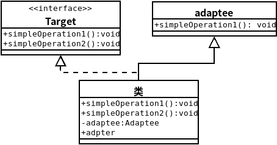
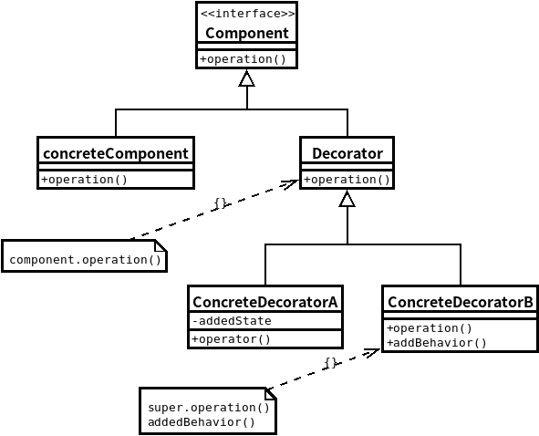
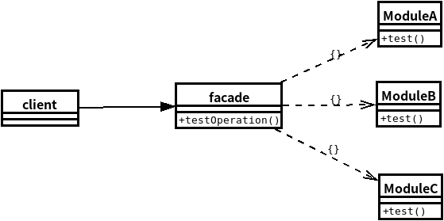
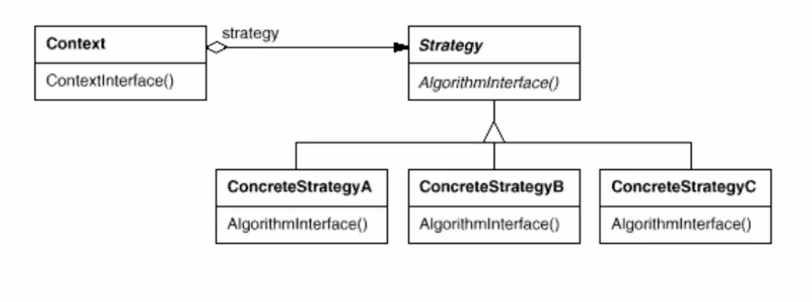
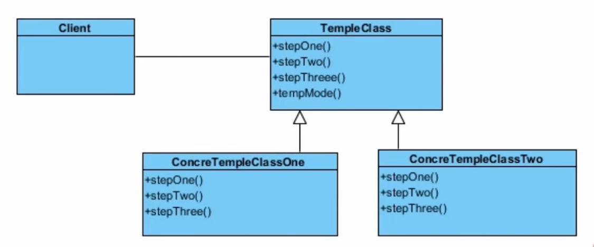
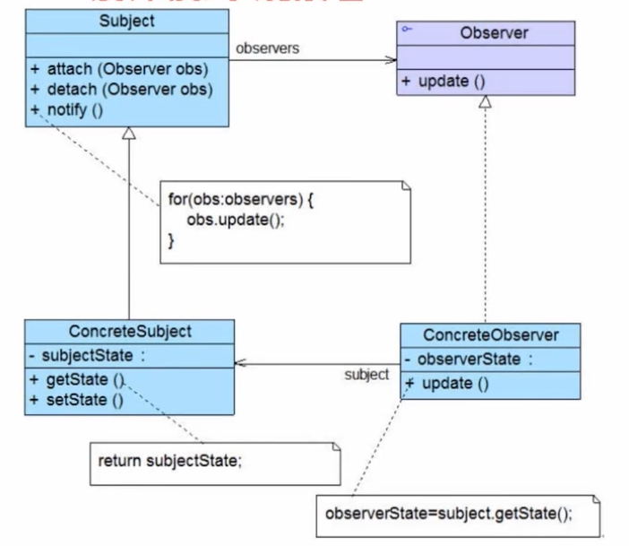
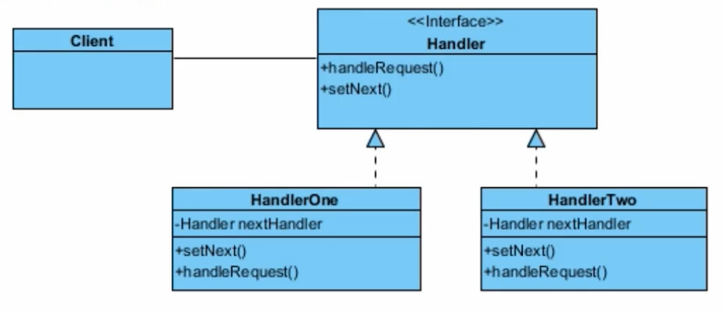

# Android 中的设计模式

## aop是什么

aop思想是什么：把通用的部分代码统一管理，动态代理，aspectJ等等


## 设计模式简介

> 一共有多少种设计模式

23种

> 什么是设计模式

是一套被反复使用，多人知晓，经过分类的，代码设计经验的总结

一些开发套路，使用在一些特定的场景


## 单例模式

**饿汉式**

**懒汉式**

**volatile 双锁模式**

1. volatile 关键字

   >  作用

   * 防止重排序
   * 线程重排序 
   *  

2. 双重锁的原因

   > 问什么要两次判断 对象是否为null

**单例的使用**

1. 注册完成后，从注册界面直接进入原来的界面

    编写一个acitivitymanager 来处理所有activity 的add /remove

2. 其他


## Adapter 模式

- #### 类适配器

    **概念**: 类的适配器模式,就是把适配类的API转换成目标类的API

    **结构:**




​									(类适配器UML)


​	类适配器使用对象继承的方式,是静态定义的方式


- #### 对象适配器

    **概念:**目的和类适配器一样,但是对象适配器不是使用继承的方式连接到Adaptee类,而是使用委派关系链接到Adaptee类的


## Builder 模式

## 装饰者模式

​	**概念:**

​	特侧

​	**UML**:

​	


 


## 外观类

​	**详解**

​	外观设计模式的主要目的是:让外部减少与子系统内部多个模块的交互,从而让外部能够更简单的使用子系统

​	它负责把客户端的请求转发给子系统的各个模块进行处理.

​	**UML**

​	


## 组合模式

​	**概念:**

​	将对象以树形结构组织起来,以达成"部分-整体"的层次结构,使得客户端对单个对象和组合对象的使用具有一致性

​	`树的结构 　－＞　组合设计模式`

​	**使用场景：**

​	１．需要表示一个对象整体或者部分层次

​	２．让客户段能够	忽略不同对象的层次结构的变化


## 策略模式

​	**概念**

​	设计一系列算法，把他们一个个封装起来，并且使他们可以相互替换．本模式可以使算法独立于使用他的客户而变化 (减少if/else)

​	**UML**

​	

​	**A应用**

​	在Volley 的httpstack


## 模板方法模式

​	**概念**

​	通过定义个算法骨架,而将算法中的步骤延迟到子类,这样子类就可以复写这些步骤的实现,来实现特定的算法

​	**UML**

​	


​	

## 观察者模式

​	**概念**

​	定义对象之间一对多的依赖关系,使得每当一个对象状态发生了改变,其相关依赖对象皆得到通知并自动更新.

​	**UML**

​	


## 责任链模式

​	**概念**

​	一个请求有多个对象来处理,这些对象是一条链,但是具体由哪个对象来处理,	根据条件判断来确定,如果不能处理会传递给下一个对象,知道有对象处理它为止.

​	**UML**

​	


​	**使用场景/实际使用**

- ​		try-catch 语句
	 ​		Ordered BroadCast
	 ​		ViewGroup / View 的事件分发机制


## Factory 设计模式

​	**概念**

​	工厂模式属于创建型设计模式，它提供了一种创建对象的最佳方式。	

​	定义了一个创建产品对象的工厂接口，将实际创建工作推迟到子类工厂当中。

### ​简单工厂模式

​	定义: 把定义不同区别的对象的创建部分,单独封装起来.

​	代码:

```java
public class SimpleDemoFactory{
    public createDemo(String require){
        Demo demo = null;
        if (require.equals("sunny")){
            demo = new SunnyDemo();
        }else if(require.equals("rainy")){
            demo = new RainyDemo();
        }
        return demo ;
    } 
}
```


### 工厂方法模式

​	定义: 与简单工厂类似,但是把原来抽取出来的部分使用抽象类的方式来生成一个抽象类的对象.把工厂继续抽象

```java
public abstract class OrderPizza{
    public OrderPizza(){
        Pizza pizza = null;
        String order;
        do{
            order = getType();
            pizza = createPizza(order);
            
            pizza.prepare();
            pizza.cut();
            pizza.box();
            pizza.sell();
        }
    }
    
    public abstract Pizza createPizza(String order);
}

public class NYOrderPizza extends OrderPizza {
    @Override
    Pizza createPizza(String order){
        Pizza p = null;
        if (order.equils("text1")){
            
        }else {
            
        }
        return p;
    }
}
```


### 抽象工厂模式

​	**概念:**

​	定义了一个创建产品对象的工厂接口，将实际创建工作推迟到子类工厂当中。

​	**代码:**

```java
public interface AbsFactory{
    public Pizza createPizza(String order)
}

public class NYFactory extends AbsFactory{
    @Override
    Pizza createPizza(String order){
        Pizza pizza = null;
        if (order.equals("cheese")){
            pizza = new NYCheesePizza();
        }else if (order.equals("pepper")){
            pizza = new NYPepperPizza();
        }
        return pizza;
    }
}
// ----------------------------------------------------------------
    public class OrderPizza {
        AbsFactory mFactory;
        
        public OrderPizza(AbsFactory absFacotry){
            setFactory(absFacotry);
        }
        
        public void setFactory(AbsFactory mFactory){
     		Pizza pizza = null; 
            String order;
            do{
                order = getType();
                pizza = mFactory.createPizza();
                if (pizza != null){
                    pizza.cut();
                    pizza.box();
                    pizza.sell();
                }
            }while(true);
                
        }
        public String setType(order){
            return "cheese";
        }
    }

public class PizzaStore(){
    public static void main(String[] args){
        OrderPizza mOrderPizza;
        mOrderPizza = new OrderPizza(new NYFactory());
    }
}


```

​	**原则:**

> ​	变量不要持有具体类的引用
>
> ​	不要让类继承于具体类,要继承与抽象类或者实现接口
>
> ​	不要覆盖基类中已经实现的方法


## 附1:

## 开-闭原则


